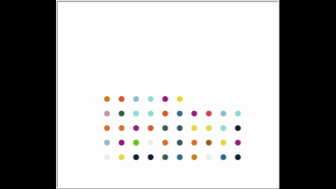

# 🚀 Day 18 - Turtle & GUI
100 Days of Code - Python Bootcamp (Day 18)

This repository contains **Day 18** code of the [100 Days of Code: The Complete Python Pro Bootcamp](https://www.udemy.com/course/100-days-of-code/?couponCode=KEEPLEARNINGBR) course by Angela Yu on Udemy.

### Key Concepts Covered:
- Importing modules
- Installing and using packages
- Working with aliases
- The Turtle Graphics
- RGB colors

## 👩‍🎨 The Hirst Painting 

