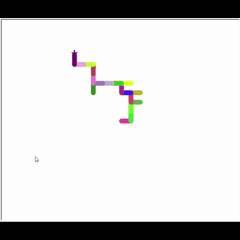

# 🚀 Day 18 - Turtle & GUI
100 Days of Code - Python Bootcamp (Day 18)

This repository contains **Day 18** code of the [100 Days of Code: The Complete Python Pro Bootcamp](https://www.udemy.com/course/100-days-of-code/?couponCode=KEEPLEARNINGBR) course by Angela Yu on Udemy.

### Key Concepts Covered:
- Importing modules
- Installing and using packages
- Working with aliases
- The Turtle Graphics
- RGB colors

### Shapes
The challange was to draw a triangle, square, pentagon, hexagon, heptagon, octagon, nonagon and decagon with a random color.

### Random walk
This challenge was basically to make the turtle go on random movements North, East, South, or West, each time it progresses by the same distance and with random colors.

### Spirograph
In this challenge we made a spirograph. We need the turtle to draw a number of circles each with a radius of a hundred in distance.

## 👩‍🎨 The Hirst Painting 
The final project was to draw a canva with dots in different colors.
We needed to use the colorgram package to pick the colors from an image and then draw the dots with the color pallete we got.

